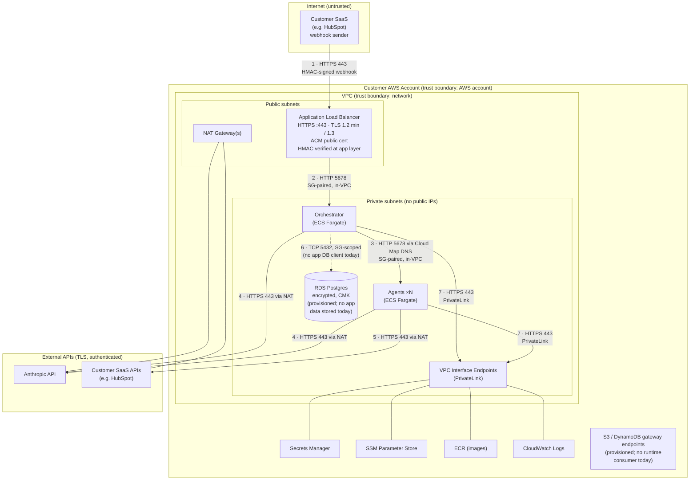

# Data Flow & Trust Boundaries

**Revenue-Growth.AI Agent Platform — Security Documentation**
Status: Current as of July 2026
Related documents: [Customer Isolation Statement](./customer-isolation.md) · [Encryption Matrix](./encryption-matrix.md) · [Secrets Access Map](./secrets-access-map.md)

---

## Overview

All data processing happens inside the customer's AWS account. The diagram below shows the path of a webhook event from the customer's SaaS system through the platform to external APIs, with trust boundaries marked. Every fact here is derived from the platform's Terraform and application source; where a control is application-layer rather than network-layer, the document says so explicitly.

## Diagram

## Hop-by-hop detail

| # | Hop | Protocol / port | Encryption in transit | Authentication / restriction |
|---|---|---|---|---|
| 1 | SaaS webhook → ALB | HTTPS 443 | TLS — minimum 1.2, TLS 1.3 supported (pinned `ELBSecurityPolicy-TLS13-1-2-2021-06`); ACM public certificate | HMAC signature (`X-Hub-Signature-256`) verified by the orchestrator application. The ALB is internet-facing for HubSpot deployments because HubSpot publishes no static source IPs; the HMAC check is the authentication boundary. Invalid header fields dropped at the ALB. |
| 2 | ALB → orchestrator | HTTP 5678 | None (in-VPC; TLS terminates at ALB) | Security-group pair: ALB SG may egress only to the orchestrator SG on this port; orchestrator SG admits only the ALB and ECS-tasks SGs. Private subnets, no public IPs. |
| 3 | Orchestrator → agents | HTTP 5678, Cloud Map DNS discovery | None (in-VPC) | Security-group pair: each agent SG admits port 5678 only from the orchestrator SG. Cloud Map provides name resolution only. |
| 4 | Tasks → Anthropic API | HTTPS 443 via NAT | TLS (Anthropic SDK / httpx defaults) | Per-deployment API key read from customer-account Secrets Manager at runtime. |
| 5 | Agents → customer SaaS APIs | HTTPS 443 via NAT | TLS | Per-agent API credentials from customer-account Secrets Manager. Network-layer egress on 443 is open for all agents; per-agent egress policy is currently enforced at the application layer (`ENABLE_EXTERNAL_EGRESS`), not the security group — see Known gaps. |
| 6 | Tasks → RDS Postgres | TCP 5432 | Not applicable today: no application code opens a database connection (no Postgres driver ships in either service). Network path is SG-scoped (RDS SG admits 5432 only from task SGs; RDS SG has no egress rules; instance is not publicly accessible). | RDS is provisioned as the persistence layer for planned agent-state features; runtime IAM grants to its credentials were removed until consuming code exists. |
| 7 | Tasks → AWS services | HTTPS 443 | TLS | Secrets Manager, SSM, ECR, and CloudWatch Logs traffic is forced through VPC interface endpoints (PrivateLink) by security-group rules; this traffic does not traverse the public internet. S3/DynamoDB gateway endpoints are also provisioned, though no application code reads or writes S3 or DynamoDB at runtime (both are used at deploy/build time — Terraform state and build artifacts — from outside the task network). |

## Trust boundaries

1. **Internet → customer account:** crossed only at the ALB (hop 1), TLS-terminated and HMAC-authenticated.
2. **AWS account boundary:** the outermost and strongest boundary — every component in the data path lives in one customer's account. See the [Customer Isolation Statement](./customer-isolation.md).
3. **Public → private subnets:** application tasks and the database have no public IPs; only the ALB and NAT gateways occupy public subnets.
4. **Egress boundary:** outbound internet access exists only on port 443 through NAT, used for the Anthropic API and customer-designated SaaS APIs. AWS-service traffic bypasses the internet entirely via PrivateLink/gateway endpoints.

## Known gaps (tracked)

Stated here deliberately, consistent with this documentation set's evidence-based approach:

- **Intra-VPC traffic is plaintext HTTP** (hops 2 and 3). TLS terminates at the ALB; service-to-service traffic inside the VPC relies on network isolation (private subnets, paired security groups) rather than transport encryption. There is no cross-tenant exposure — the deployment is single-tenant — and mTLS between services is on the productization roadmap.
- **Per-agent egress gating is application-layer, not network-layer** (hop 5). The security-group rule permitting outbound 443 exists for every agent; the `ENABLE_EXTERNAL_EGRESS` flag is enforced in application configuration. Moving this control to the security group is a tracked improvement.
