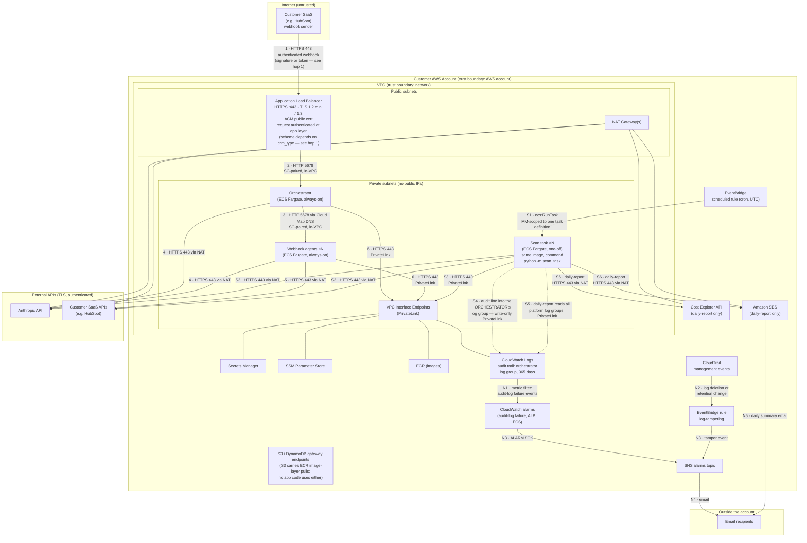

# Data Flow & Trust Boundaries

**Revenue-Growth.AI Agent Platform — Security Documentation**
Status: Current as of September 2026
Related documents: [Customer Isolation Statement](./customer-isolation.md) · [Encryption Matrix](./encryption-matrix.md) · [Secrets Access Map](./secrets-access-map.md)

---

## Overview

All data processing happens inside the customer's AWS account. The diagram below shows **two independent entry paths** into the platform, plus the **outbound notifications** that deliberately leave it, with trust boundaries marked:

1. **Webhook path** (hops 1-6) — the always-on flow: customer SaaS → ALB → orchestrator → agents.
2. **Scheduled-scan path** (hops S1-S6) — opt-in per agent. EventBridge invokes the agent's scan entry point directly. It never touches the ALB or the orchestrator, so **no HMAC boundary applies to it**.
3. **Outbound notifications** (hops N1-N5) — alarm, tamper-alert and report emails. These are the only flows whose content leaves the account by design.

Every fact here is derived from the platform's Terraform and application source and checked against the first production deployment. Where a control is application-layer rather than network-layer, the document says so explicitly.

**No database is provisioned by default.** Earlier versions of this document showed an RDS PostgreSQL instance; it is now opt-in (`enable_rds`, default `false`). See [Database (optional)](#database-optional).

## Diagram

```mermaid
flowchart TB
    subgraph INTERNET["Internet (untrusted)"]
        SAAS["Customer SaaS<br/>(e.g. HubSpot)<br/>webhook sender"]
    end

    subgraph CUSTACCT["Customer AWS Account (trust boundary: AWS account)"]
        subgraph VPC["VPC (trust boundary: network)"]
            subgraph PUB["Public subnets"]
                ALB["Application Load Balancer<br/>HTTPS :443 · TLS 1.2 min / 1.3<br/>ACM public cert<br/>request authenticated at app layer<br/>(scheme depends on crm_type — see hop 1)"]
                NAT["NAT Gateway(s)"]
            end
            subgraph PRIV["Private subnets (no public IPs)"]
                ORCH["Orchestrator<br/>(ECS Fargate, always-on)"]
                AGENTS["Webhook agents ×N<br/>(ECS Fargate, always-on)"]
                SCAN["Scan task ×N<br/>(ECS Fargate, one-off)<br/>same image, command<br/>python -m scan_task"]
                VPCE["VPC Interface Endpoints<br/>(PrivateLink)"]
            end
        end
        SM["Secrets Manager"]
        SSM["SSM Parameter Store"]
        ECR["ECR (images)"]
        CWL["CloudWatch Logs<br/>audit trail: orchestrator<br/>log group, 365 days"]
        EVB["EventBridge<br/>scheduled rule (cron, UTC)"]
        S3G["S3 / DynamoDB gateway endpoints<br/>(S3 carries ECR image-layer pulls;<br/>no app code uses either)"]
        CT["CloudTrail<br/>management events"]
        EVT["EventBridge rule<br/>log-tampering"]
        CWA["CloudWatch alarms<br/>(audit-log failure, ALB, ECS)"]
        SNS["SNS alarms topic"]
        SES["Amazon SES<br/>(daily-report only)"]
        CE["Cost Explorer API<br/>(daily-report only)"]
    end

    subgraph EXT["External APIs (TLS, authenticated)"]
        ANTH["Anthropic API"]
        CRM["Customer SaaS APIs<br/>(e.g. HubSpot)"]
    end

    subgraph OUTSIDE["Outside the account"]
        MAIL["Email recipients"]
    end

    SAAS -- "1 · HTTPS 443<br/>authenticated webhook<br/>(signature or token — see hop 1)" --> ALB
    ALB -- "2 · HTTP 5678<br/>SG-paired, in-VPC" --> ORCH
    ORCH -- "3 · HTTP 5678 via Cloud Map DNS<br/>SG-paired, in-VPC" --> AGENTS
    ORCH -- "4 · HTTPS 443 via NAT" --> ANTH
    AGENTS -- "4 · HTTPS 443 via NAT" --> ANTH
    AGENTS -- "5 · HTTPS 443 via NAT" --> CRM
    ORCH -- "6 · HTTPS 443<br/>PrivateLink" --> VPCE
    AGENTS -- "6 · HTTPS 443<br/>PrivateLink" --> VPCE
    VPCE --- SM
    VPCE --- SSM
    VPCE --- ECR
    VPCE --- CWL
    NAT --- ANTH
    NAT --- CRM
    NAT --- SES
    NAT --- CE

    EVB -- "S1 · ecs:RunTask<br/>IAM-scoped to one task definition" --> SCAN
    SCAN -- "S2 · HTTPS 443 via NAT" --> ANTH
    SCAN -- "S2 · HTTPS 443 via NAT" --> CRM
    SCAN -- "S3 · HTTPS 443<br/>PrivateLink" --> VPCE
    SCAN -. "S4 · audit line into the ORCHESTRATOR's<br/>log group — write-only, PrivateLink" .-> CWL
    SCAN -. "S5 · daily-report reads all<br/>platform log groups, PrivateLink" .-> CWL
    SCAN -- "S6 · daily-report<br/>HTTPS 443 via NAT" --> SES
    SCAN -- "S6 · daily-report<br/>HTTPS 443 via NAT" --> CE

    CWL -- "N1 · metric filter:<br/>audit-log failure events" --> CWA
    CT -- "N2 · log deletion or<br/>retention change" --> EVT
    CWA -- "N3 · ALARM / OK" --> SNS
    EVT -- "N3 · tamper event" --> SNS
    SNS -- "N4 · email" --> MAIL
    SES -- "N5 · daily summary email" --> MAIL
```

## Hop-by-hop detail

### Webhook path (always on)

| # | Hop | Protocol / port | Encryption in transit | Authentication / restriction |
|---|---|---|---|---|
| 1 | SaaS webhook → ALB | HTTPS 443 | TLS — minimum 1.2, TLS 1.3 supported (pinned `ELBSecurityPolicy-TLS13-1-2-2021-06`); ACM public certificate | Request signature verified by the orchestrator application. With `crm_type = "hubspot"` (the default) that is HubSpot's v3 signature (`X-HubSpot-Signature-v3` plus a request timestamp no older than 5 minutes); a request carrying a matching `X-Admin-Token` skips it. With `crm_type = "salesforce"` the orchestrator requires the deployment's webhook secret in an `X-Webhook-Token` header and an allowlisted Salesforce org ID in every event's `organizationId` field (Salesforce does not sign callouts, so there is no signature), in addition to the ALB allowlist of Salesforce's shared outbound ranges; with `other`, an HMAC-SHA256 body signature (`X-Hub-Signature-256`) is checked when a webhook secret is configured. The ALB is internet-facing for HubSpot deployments because HubSpot publishes no static source IPs; the HMAC check is the authentication boundary. Invalid header fields dropped at the ALB. |
| 2 | ALB → orchestrator | HTTP 5678 | None (in-VPC; TLS terminates at ALB) | Security-group pair: ALB SG may egress only to the orchestrator SG on this port; orchestrator SG admits only the ALB and ECS-tasks SGs. Private subnets, no public IPs. |
| 3 | Orchestrator → agents | HTTP 5678, Cloud Map DNS discovery | None (in-VPC) | Security-group pair: each agent SG admits port 5678 only from the orchestrator SG. Cloud Map provides name resolution only. Only agents with an always-on ECS service (`enable_agent_service = true`) are reachable here; a scan-only agent has no running task and no Cloud Map name, so this hop cannot reach it. |
| 4 | Tasks → Anthropic API | HTTPS 443 via NAT | TLS (Anthropic SDK / httpx defaults) | Per-deployment API key read from customer-account Secrets Manager at runtime. |
| 5 | Agents → customer SaaS APIs | HTTPS 443 via NAT | TLS | Per-agent API credentials from customer-account Secrets Manager. Network-layer egress on 443 is open for all agents; per-agent egress policy is currently enforced at the application layer (`ENABLE_EXTERNAL_EGRESS`), not the security group — see Known gaps. |
| 6 | Tasks → AWS services | HTTPS 443 | TLS | Secrets Manager, SSM, ECR (API and Docker registry) and CloudWatch Logs resolve to VPC interface endpoints (PrivateLink) through private DNS, so this traffic does not traverse the public internet. Interface endpoints for SSM Messages and EC2 Messages are also provisioned, but nothing uses them: ECS Exec is not enabled on any service. The S3 and DynamoDB gateway endpoints are attached to the private route table: S3 carries ECR image-layer downloads when a task starts (ECR stores image layers in S3), and DynamoDB has no runtime consumer. No application code reads or writes S3 or DynamoDB at runtime; both are used at deploy/build time (Terraform state and build artifacts) from outside the task network. |

### Database (optional)

The platform can provision an RDS PostgreSQL instance but **does not by default** (`enable_rds = false` in the base repo). No application code opens a database connection — no Postgres driver ships in any service — and application audit records live in CloudWatch Logs, not a database. The first production deployment's instance recorded zero connections across its life and was removed on 2026-09-12; its final snapshot is retained.

Network configuration that remains when no database exists:

- **The RDS security group.** It is deliberately not gated on `enable_rds`, because other security groups reference it. It admits TCP 5432 only from the ECS-tasks security group and has no egress rules.
- **A TCP 5432 egress rule to that group in every task security group.** With no instance behind it, nothing listens on this path.
- **The database subnets and DB subnet group**, so re-enabling needs no network change.

When `enable_rds = true`, the instance is encrypted with a dedicated customer-managed KMS key, sits in the database subnets with no public IP, and accepts 5432 only from the ECS-tasks security group.

---

### Scheduled-scan path (opt-in per agent)

Enabled per agent by `enable_scheduled_scan`; provisioned by
`3-rg-ai-agent-platform-agent/scheduled_scan.tf`. An agent can also be
**scan-only** (`enable_agent_service = false`): it has no always-on task and no
Cloud Map name, so this path is its only entry point.

| # | Hop | Protocol / port | Encryption in transit | Authentication / restriction |
|---|---|---|---|---|
| S1 | EventBridge → scan task | AWS control plane (`ecs:RunTask`) | TLS (AWS API) | No network ingress at all — the trigger is a cron schedule, not a request. Authorisation is IAM: a dedicated role whose policy permits `ecs:RunTask` on **one specific scan task definition ARN**, conditioned to the platform's ECS cluster, plus `iam:PassRole` for that agent's two task roles. The task runs on Fargate in private subnets with `assign_public_ip = false`, in the agent's own security group. |
| S2 | Scan task → Anthropic / customer SaaS APIs | HTTPS 443 via NAT | TLS | Same credentials and same egress path as hops 4 and 5 — the scan runs the agent's own image and calls the same per-record function the webhook path calls. |
| S3 | Scan task → AWS services | HTTPS 443 | TLS | Secrets Manager, SSM, ECR and CloudWatch Logs via PrivateLink, identical to hop 6. |
| S4 | Scan task → orchestrator's log group | HTTPS 443 | TLS | **The only cross-component write on the platform.** The agent's task role is granted `logs:CreateLogStream` and `logs:PutLogEvents` scoped to the orchestrator's log group ARN only — no read, no other log group. This keeps one audit trail of all CRM-driven actions even for runs the orchestrator never saw; full operational logs still go to the agent's own log group. The orchestrator log group retains events for 365 days. If a run cannot write its audit trail, the scan still completes but emits `orchestrator_audit_log_disabled` or `orchestrator_audit_log_stream_failed`, which raises an alarm (hop N1). |
| S5 | daily-report → all platform log groups | HTTPS 443 | TLS | **The only runtime read of the audit trail.** daily-report's task role holds `logs:FilterLogEvents` and `logs:DescribeLogStreams` on `/ecs/{project}-{environment}/*` — every agent's log group and the orchestrator's — plus `logs:DescribeLogGroups`, which has no resource-level scoping. It uses them to count each agent's successes and errors for its daily summary. Via PrivateLink, like hop 6. |
| S6 | daily-report → Cost Explorer and SES | HTTPS 443 via NAT | TLS | Neither service has a VPC endpoint provisioned, so both calls leave through NAT even though daily-report's `ENABLE_EXTERNAL_EGRESS` is `false` (see the egress gap under Known gaps). IAM: `ce:GetCostAndUsage` on `*` (Cost Explorer has no resource-level scoping) against the us-east-1 endpoint, and `ses:SendEmail` / `ses:SendRawEmail` scoped to one verified sender identity. The resulting email is hop N5. |

**What this path does not have.** No ALB, no TLS termination, no HMAC
verification, and no orchestrator routing decision. Those controls belong to the
webhook path; a scheduled run is authorised by the EventBridge schedule plus the
scoped IAM role. Anyone able to modify that rule, or to call `ecs:RunTask` on the
scan task definition, can invoke an agent against live CRM data without crossing
the perimeter described in hops 1-2.

**`ecs:RunTask` also accepts container overrides.** A caller can change a scan's
environment at launch — for example `TARGET_RECORD_IDS`, which selects the records
it processes, or `ORCHESTRATOR_LOG_GROUP`, which when set empty disables that run's
audit trail. The second is detected by the audit-log-failure alarm (hop N1),
verified end to end on 2026-09-13, but it is not prevented.

**Cron is UTC.** EventBridge schedule expressions here have no timezone support,
so a schedule pinned to local time drifts by an hour at daylight-saving
transitions.

---

### Outbound notifications

| # | Hop | Protocol / port | Encryption in transit | Authentication / restriction |
|---|---|---|---|---|
| N1 | Agent log group → CloudWatch alarm | AWS internal | — | A metric filter on each audit-writing scan agent's own log group matches `orchestrator_audit_log_disabled` / `orchestrator_audit_log_stream_failed`; the alarm fires on one or more matches in a 5-minute period. Created only when `enable_scheduled_scan` and `enable_audit_log_alarm` are both true — daily-report writes no audit lines and has no such alarm. The base repo's ALB 5xx and ECS CPU alarms publish to the same topic. |
| N2 | CloudTrail → EventBridge log-tampering rule | AWS control plane | TLS (AWS internal) | Matches `DeleteLogGroup`, `DeleteLogStream`, `PutRetentionPolicy` and `DeleteRetentionPolicy` from CloudTrail management events. The trail also delivers to an S3 bucket with versioning and log-file validation enabled. |
| N3 | Alarm / rule → SNS alarms topic | AWS internal | — | The topic policy allows only `cloudwatch.amazonaws.com` and `events.amazonaws.com` to publish. |
| N4 | SNS → email subscribers | SMTP | Depends on the recipient's mail server; email is not an end-to-end encrypted channel | **Leaves the account.** Alarm emails carry the alarm name, description and state-change reason; tamper alerts carry the API action, log group name, calling principal ARN and source IP. Each address must confirm its subscription out of band before it receives anything. |
| N5 | SES → report recipients | SMTP | As N4 | **Leaves the account.** daily-report's summary contains per-agent success and error counts, error details with record IDs where the log line carries one, and AWS account cost for yesterday and month-to-date. Sender and recipients are set in the agent's code; the account is in the SES sandbox, so only verified identities can receive it. |

## Trust boundaries

1. **Internet → customer account:** crossed inbound only at the ALB (hop 1), TLS-terminated and
   HMAC-authenticated. The scheduled-scan path does not cross this boundary at all — it
   originates inside the account (hop S1), which is why no HMAC applies to it.
2. **AWS account boundary:** the outermost and strongest boundary — every component in the data path lives in one customer's account. See the [Customer Isolation Statement](./customer-isolation.md). Outbound notification content (hops N4 and N5) crosses it by design.
3. **Public → private subnets:** application tasks have no public IPs; only the ALB and NAT gateways occupy public subnets. Database subnets exist but hold no instance unless `enable_rds` is true.
4. **Egress boundary:** outbound internet access from tasks exists only on port 443 through NAT — used for the Anthropic API, customer-designated SaaS APIs, and, for daily-report, the Cost Explorer and SES APIs, which have no VPC endpoint. Other AWS-service traffic uses PrivateLink or gateway endpoints.

## Known gaps (tracked)

Stated here deliberately, consistent with this documentation set's evidence-based approach:

- **Intra-VPC traffic is plaintext HTTP** (hops 2 and 3). TLS terminates at the ALB; service-to-service traffic inside the VPC relies on network isolation (private subnets, paired security groups) rather than transport encryption. There is no cross-tenant exposure — the deployment is single-tenant — and encrypting this traffic is tracked as [issue #13](https://github.com/revenue-growth-ai-org/rg-ai-agent-platform-docs/issues/13).
- **Per-agent egress gating is application-layer, not network-layer** (hops 5 and S6). The security-group rule permitting outbound 443 exists for every agent; the `ENABLE_EXTERNAL_EGRESS` flag is enforced in application configuration. Moving this control to the security group is tracked as [issue #14](https://github.com/revenue-growth-ai-org/rg-ai-agent-platform-docs/issues/14).
- **Audit log deletion is detected, not prevented** (hop N2). Retention is 365 days and deletion or retention changes raise an alert, but a sufficiently privileged principal can still delete a log group. A self-defending IAM deny ships disabled (`enable_log_delete_protection`); enabling it, or adding an S3 archive with Object Lock, is tracked in [issue #21](https://github.com/revenue-growth-ai-org/rg-ai-agent-platform-docs/issues/21).
- **A run's audit trail can be switched off at launch** (hop S1). Anyone who can call `ecs:RunTask` on a scan task definition can override `ORCHESTRATOR_LOG_GROUP`. The audit-log-failure alarm detects it (hop N1); nothing prevents it. Not yet tracked as a separate issue.
